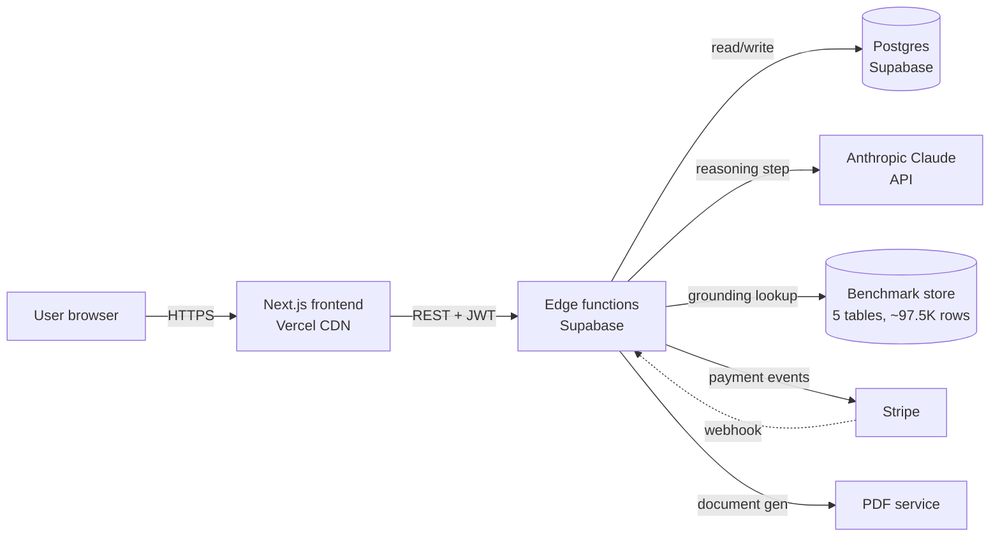

# Quantis — Architecture

> System design for the AIWMC Quantis financial-validation engine.  
> Live product: [aiwmcquantis.com](https://aiwmcquantis.com)

This document describes the public surface of the Quantis architecture: the components, the data flow, the technology choices, and the tradeoffs. Internal logic — prompt templates, benchmark dataset, scoring weights, failure-mode test definitions — is private.

---

## 1. Problem

Founders make bets on incomplete information. Most "AI business validation" tools wrap a single LLM call with a prompt and return paragraph-form opinions. That output isn't decision-ready: it isn't grounded in real industry data, isn't structured for comparison across ideas, and isn't testable against the user's actual financial reality.

Quantis is built around three constraints:

1. Outputs must be **structured** — every analysis returns the same schema, so a user can compare two business ideas side by side without re-reading prose.
2. Outputs must be **grounded** — every financial number is anchored to a benchmark dataset, not invented by the model.
3. Outputs must be **inspectable** — every claim should trace back to a benchmark row or a stated assumption, not a black-box generation.

## 2. System overview

## 3. Components

| Component | Responsibility | Stack |
|---|---|---|
| **Frontend** | Authenticated UI, validation submission, result rendering, document download | Next.js, React, TypeScript, Tailwind, Vercel |
| **API layer** | Auth, request validation, orchestration, output validation | Supabase Edge Functions (Deno), TypeScript |
| **Persistence** | User state, validation history, benchmark dataset, audit log | PostgreSQL (Supabase) with row-level security |
| **LLM layer** | Bounded reasoning step inside the validation pipeline | Anthropic Claude API |
| **Benchmark store** | Industry medians, regional cost data, archetype unit economics, risk-factor priors | Postgres (5 tables, ~97,500 rows) |
| **Billing** | Subscriptions, usage metering, invoicing | Stripe + idempotent webhook handlers |
| **Document service** | PDF generation for validations, invoices, financial summaries | Edge function + headless renderer |
| **Observability** | Errors, performance, product analytics | Sentry, PostHog |

## 4. Data flow — submitting a validation

1. User submits a business description through the frontend.
2. The API layer validates the request shape, attaches the authenticated account, and writes a `validation` row in `pending` state.
3. The orchestrator pulls relevant benchmark rows from the benchmark store based on detected industry and region.
4. The orchestrator constructs a structured prompt — system instructions, the user's business description, and the relevant benchmark rows as context — and calls the LLM.
5. The LLM returns a structured response (JSON conforming to the validation schema).
6. The output validator checks the response against the schema and runs the failure-mode tests (see [failure-modes.md](./failure-modes.md)).
7. If all tests pass, the validation row is updated to `complete`. If any fail, the request is retried with corrective context or escalated for review.
8. The user is notified, the validation is rendered, and a PDF can be generated on demand.

## 5. The LLM is one component, not the system

This is the most important architectural decision in Quantis. The LLM does **bounded reasoning over a structured prompt with a structured output schema**. Everything else is deterministic: input validation, schema enforcement, benchmark grounding, output validation, failure-mode tests, persistence, and billing.

The model's job is small. Reliability comes from the deterministic shell, not from the model.

Concretely:

- The model never decides what schema to return — the schema is fixed.
- The model never invents a benchmark — benchmarks are pulled from the database before the call and passed in as context.
- Every benchmark cited in the output must resolve to a real source row, or the output is rejected.
- The model's output is validated, tested, and either accepted, retried, or rejected. There is no "trust the model" path.
- The model is replaceable. Anthropic Claude is the current choice for reasoning quality; the orchestrator interface is provider-agnostic at the boundary.

This is why Quantis 2.0 is moving to a multi-agent design with twelve failure-mode tests per analysis — not because LLMs got better, but because the deterministic shell got tighter.

## 6. Storage model

Five primary tables in the application database:

| Table | Purpose | Access |
|---|---|---|
| `accounts` | User and team accounts, plan, usage counters | RLS by account |
| `validations` | Submitted analyses and their results | RLS by account |
| `documents` | Generated PDFs and metadata | RLS by account |
| `audit_log` | Append-only record of every validation run | Service role only |
| `webhook_events` | Stripe and other webhook deliveries (idempotency) | Service role only |

The benchmark store lives in five separate tables (industry medians, regional cost data, archetype unit economics, risk-factor priors, coverage scores). Row-level security is enforced on everything user-facing; the service role is used only for orchestration. A pre-deploy CI gate fails any schema change that introduces a public table without an RLS policy.

## 7. Tradeoffs and why

**Supabase over a custom backend.** Supabase gives Postgres, auth, storage, and edge functions in one envelope. For a solo operator shipping a product, this is the right tradeoff — the time saved on infra is spent on product. Migration risk is bounded because Postgres is portable.

**Edge functions over a long-running server.** Validations are bursty and stateless after the database write. Edge functions scale to zero, deploy instantly, and remove an entire class of operational concerns. The tradeoff is cold-start latency, mitigated by warm pools on the critical path.

**Next.js SSG over the original SPA.** The original Quantis was a pure client-rendered SPA. Google could not index it, which made organic acquisition impossible — every public page returned an empty shell to crawlers. The migration to static rendering for marketing surface is in flight; the application surface remains client-rendered behind auth.

**One LLM provider, abstracted at the boundary.** Single-provider risk is real. The orchestrator interface accepts any model that can return structured output; the prompt construction layer is provider-agnostic. The cost is one extra layer of indirection. The benefit is replaceability and the option to mix providers per agent in 2.0.

**Stripe over self-hosted billing.** Uncontroversial; flagged here for completeness.

## 8. What's evolving — Quantis 2.0

Quantis 2.0 replaces the single-pass model with a multi-agent validation system:

- Four autonomous validation agents handle different layers of the analysis (industry classification, unit economics, cost structure, risk factors).
- Twelve failure-mode tests run on each analysis before the result is accepted.
- The output validator becomes a dedicated agent rather than a procedural check, so it can issue corrective instructions instead of just rejecting outputs.
- The UI is being redesigned around a Bloomberg-terminal aesthetic — dense, inspectable, comparison-first.

This document will be updated as 2.0 lands.

## 9. What this document does not contain

- Prompt templates and system instructions
- The benchmark dataset and how it is computed
- Failure-mode test definitions, weights, or thresholds
- Scoring logic and risk-flagging rules
- Production source code

These are private. For a walkthrough under NDA, reach out via [LinkedIn](https://www.linkedin.com/in/bogdan-jeltov-6218b9324).
